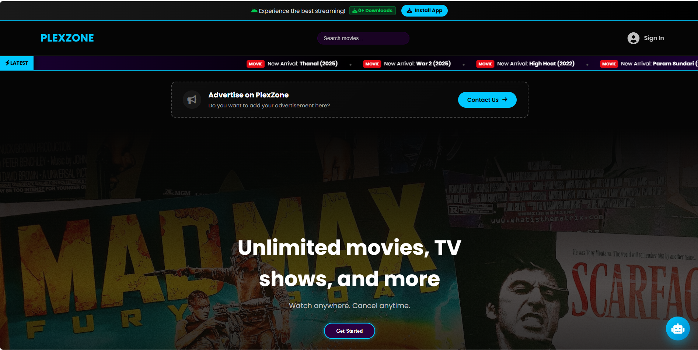
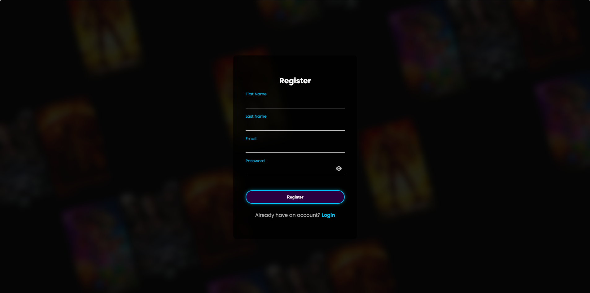
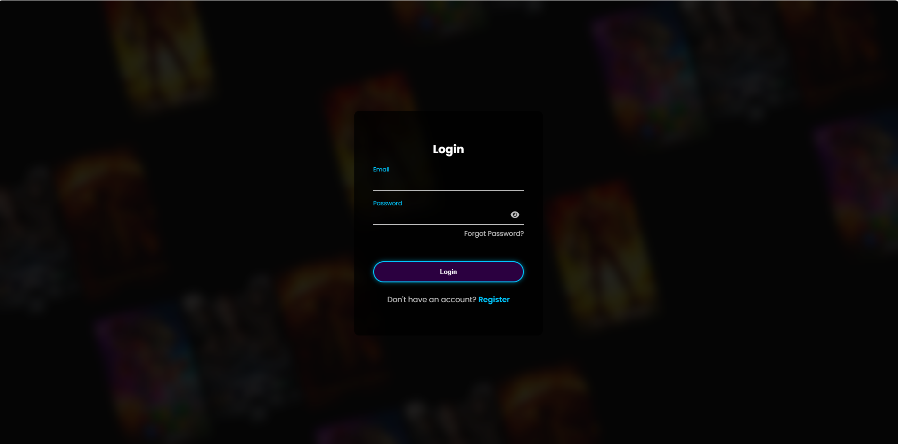

# Movie Streaming Web App

A web-based movie streaming platform that allows users to browse and watch movies with an interactive UI and dynamic content.

## Features
- Movie browsing and listing
- Video player integration
- User interaction (favorites / watch)
- Dynamic content loading
- Responsive UI design

## Technologies
- HTML, CSS, JavaScript
- PHP (if used)
- MySQL
- CDN integration (for media streaming)

## Screenshots

### Home Page

### Movie List

### Login / Register

## Author
Rasindu Thenuwara
